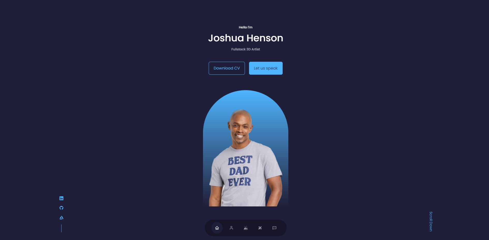

# React Portfolio

## Installation

1. Download/ Clone this repository;.
2. **Node.js** is required to test this application.
3. `npm install` in terminal to install all required dependencies.

## Usage

* `npm start` to open portfolio.
* `npm run build` to generate a build from React.

* [Deployed Portfolio](https://boiledlettuce.github.io/Joshua-Henson-React-Portfolio/)

## Features 

* Javascript
* React based
* Github pages
* Insomnia
* .env
* MongoDB
* Mongoose
* npm

Copyright (c) BoiledLettuce. All rights reserved.